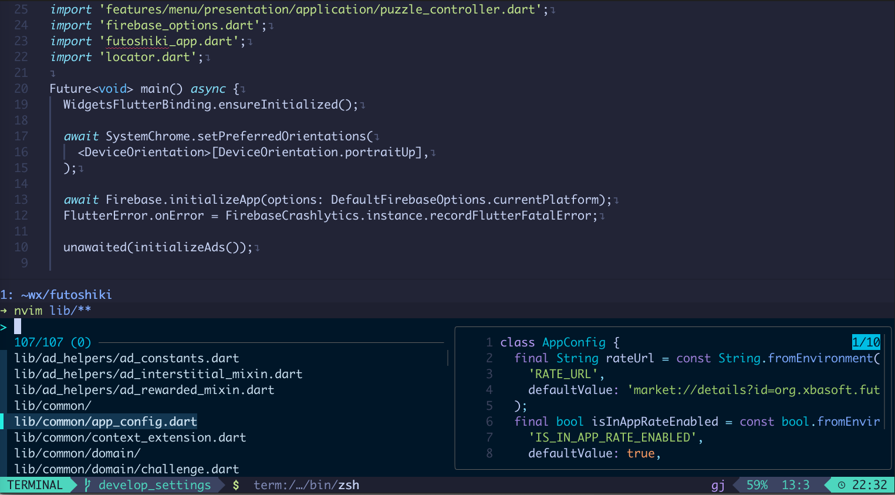

# Dotfiles

My various dotfiles for:

## Programs

* nvim and lazyvim
* zsh
* [eza (better ls)](https://github.com/eza-community/eza)
* [FZF](https://github.com/junegunn/fzf)
* [fd](https://github.com/sharkdp/fd)
* [Bat (better cat)](https://github.com/sharkdp/bat)
* [todo.txt](http://todotxt.com/)
* [zoxide](https://github.com/ajeetdsouza/zoxide)

## Additional packages

* **zsh**:
  * [zsh-completions](https://github.com/zsh-users/zsh-completions)
  * [zsh-highlighting](https://github.com/zsh-users/zsh-syntax-highlighting)
  * [Spaceship prompt](https://github.com/spaceship-prompt)

## Screenshot

